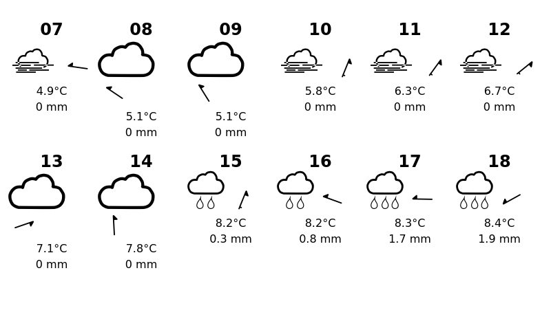

# Juistini - Just in time info at your doorstep
WIP. E-paper info board with different information that could be useful for when entering or exiting your home.

Building on [Waveshare e-paper](https://github.com/waveshare/e-Paper) and [Raspberry Pi Zero W](https://www.raspberrypi.org/products/raspberry-pi-zero-w/), but should be created to work with other screens and Linux computers as well. So I guess the push of images to the screen should only be described, but not be a part of this module.



## Hardware
Raspberry Pi Zero WH
E-paper screen - [800×480, 7.5inch E-Ink display - Hat for Raspberry P]i(https://www.waveshare.com/7.5inch-e-paper-hat.htm)
Real-time clock - [WittyPi Mini - RTC + Power Management for Raspberry Pi](https://thepihut.com/products/witty-pi-3-mini-rtc-power-management-for-raspberry-pi-zero)  - [Documentation](http://www.uugear.com/doc/WittyPiMini_UserManual.pdf)

## Packages to install

### Chromium for headless screenshot
```console
sudo apt-get install chromium-browser
```

### GraphicsMagick
```console
sudo apt-get install graphicsmagick
```


### Node.js - latest version (v14 for now)
 [audstanley / NodeJs-Raspberry-Pi](https://github.com/audstanley/NodeJs-Raspberry-Pi)
```console
wget -O - https://raw.githubusercontent.com/audstanley/NodeJs-Raspberry-Pi/master/Install-Node.sh | sudo bash;
node -v;
sudo node-install -v 14;
```

## Running Justini
Basically, you do three things to get the weather onto the display.
1. Create a screenshot of justini.htm
2. Convert it to a 1 bit .bmp file
3. Update the screen

### In crontab
```console
@reboot pi sleep 30 && chromium-browser --headless --virtual-time-budget=10000 --disable-gpu --screenshot=/home/pi/git_modules/justini/img/screenshot.png --window-size=800,480 /home/pi/git_modules/justini/justini.html && gm convert -depth 1 /home/pi/git_modules/justini/img/screenshot.png /home/pi/git_modules/justini/img/screenshot.bmp && python /home/pi/git_modules/justini/python/justini.py
```


### Screenshot of HTML page
```console
chromium-browser --headless --virtual-time-budget=10000 --disable-gpu --screenshot --window-size=800,480 ./justini.html
``` 

### Convert it to 1 bit black and white BMP file
```console
gm convert -depth 1 screenshot.png screenshot.bmp
```

### Waveshare python screen update
```console
python justini.py
```
... need to add python and waveshare install
